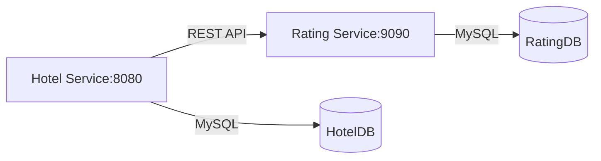

# 🏨⭐ Hotel Management & Rating Microservices  
*A Spring Boot-based modular system with real-time rating synchronization*  

---

## 🌟 **Key Features**  
- **Decoupled Architecture**: Two independent services (Hotel + Rating)  
- **Real-Time Data Sync**: Ratings fetched dynamically via REST  
- **CRUD Operations**: Full hotel lifecycle management  
- **MySQL Backed**: Separate databases for each service  

---

## 🏗️ **Architecture Overview**  



---

## 🔌 **Service Ports & Tech Stack**  

| Service               | Port  | Technologies                          |
|-----------------------|-------|---------------------------------------|
| **Hotel Management**  | 8080  | Spring Boot, JPA/Hibernate, MySQL     |
| **Rating Service**    | 9090  | Spring Boot, MySQL, REST APIs         |

---

## 🏨 **Hotel Management Service**  

### 📍 **Endpoints**  
| Method   | Endpoint                          | Description                          |
|----------|-----------------------------------|--------------------------------------|
| `POST`   | `/hotel/createhotel`              | Create new hotel                     |
| `GET`    | `/hotel/gethotel/{id}`            | Get hotel + live rating              |
| `GET`    | `/hotel/getallhotels`             | List all hotels                      |
| `PUT`    | `/hotel/updateHotel/{id}`         | Full hotel update                    |
| `PUT`    | `/hotel/updatehotelAddress/{id}`  | Partial address update               |
| `DELETE` | `/hotel/deleteHotel/{id}`         | Remove hotel                         |

### 🛠️ **Sample Request**  
```json
POST /hotel/createhotel
{
  "name": "Taj Mahal Palace",
  "address": "Apollo Bunder",
  "city": "Mumbai",
  "postalCode": "400001",
  "isAvailable": true
}
```

---

## ⭐ **Rating Service**  

### 📍 **Endpoints**  
| Method   | Endpoint                          | Description                          |
|----------|-----------------------------------|--------------------------------------|
| `POST`   | `/rating/addrating`               | Submit new rating                    |
| `GET`    | `/rating/getratingbyhotelid/{id}` | Fetch rating by hotel ID             |

### 🎯 **Sample Interaction**  
```json
POST /rating/addrating
{
  "hotelId": 152,
  "hotelActualRating": 4.7
}
```

---

## 🗄️ **Database Configuration**  

### Hotel Service (`application.yml`)  
```yaml
spring:
  datasource:
    url: jdbc:mysql://localhost:3306/HotelDB
    username: root
    password: root
  jpa:
    hibernate.ddl-auto: update
server:
  port: 8080
```

### Rating Service (`application.yml`)  
```yaml
spring:
  datasource:
    url: jdbc:mysql://localhost:3306/RatingDB
    username: root
    password: root
  jpa:
    hibernate.ddl-auto: update
server:
  port: 9090
```

---
⚠️ Make sure both HotelDB and RatingDB databases exist in MySQL. You can create them using:

sql
Copy
Edit
CREATE DATABASE HotelDB;
CREATE DATABASE RatingDB;


## 🔄 **Inter-Service Communication**  
- Hotel Service uses `RestTemplate` to call:  
  `http://localhost:9090/rating/getratingbyhotelid/{id}`  
- **Dependency**: Rating Service must be running for `/gethotel/{id}` to work  

---

## 🧪 **Testing Guide**  

### Via cURL:  
```bash
# Create hotel
curl -X POST http://localhost:8080/hotel/createhotel \
-H "Content-Type: application/json" \
-d '{"name":"Grand Hyatt","city":"Mumbai"}'

# Add rating
curl -X POST http://localhost:9090/rating/addrating \
-H "Content-Type: application/json" \
-d '{"hotelId":1,"hotelActualRating":4.5}'
```

### Recommended Tools:  
- Postman  
- Swagger UI (if implemented)  
- IntelliJ HTTP Client  

---

## 👨‍💻 **Developer Profile**  
**B Rahul Naik**  
🎓 Mechanical Engineer → Tech Enthusiast  
🛠️ Skills: Java, Spring Boot, SQL, Python, Power BI  
🔗 Portfolio: [GitHub/RahulNaik2611](https://github.com/RahulNaik2611)  

> *"Passionate about building scalable systems and solving real-world problems through code."*  

---

## 🚀 **Getting Started**  
1. Clone the repo  
2. Start MySQL and create `HotelDB` + `RatingDB`  
3. Launch both services:  
   ```bash
   cd hotel-service && mvn spring-boot:run
   cd rating-service && mvn spring-boot:run
   ```
4. Test endpoints using Postman  

---


